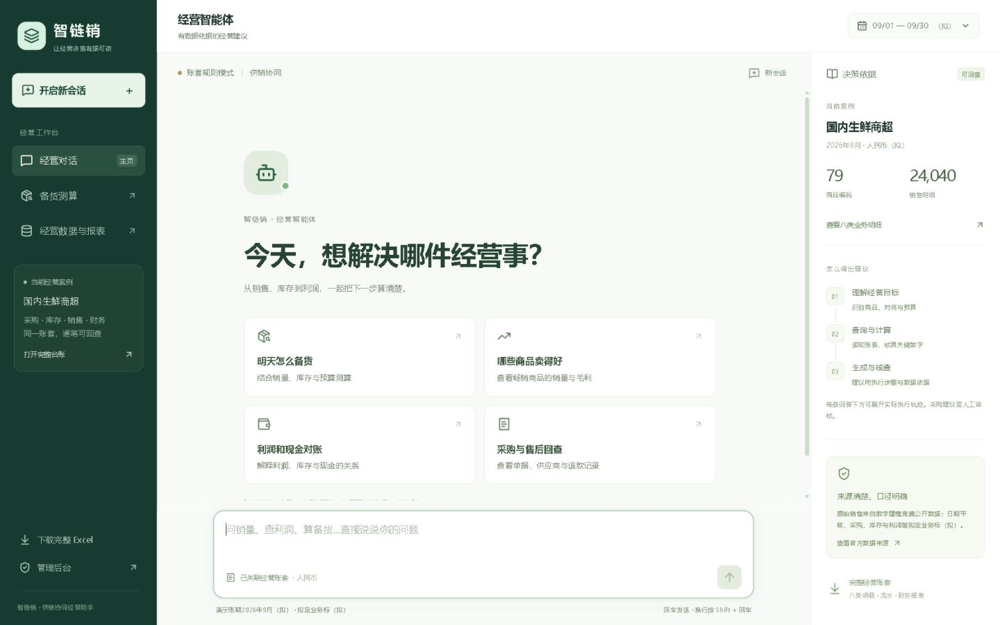
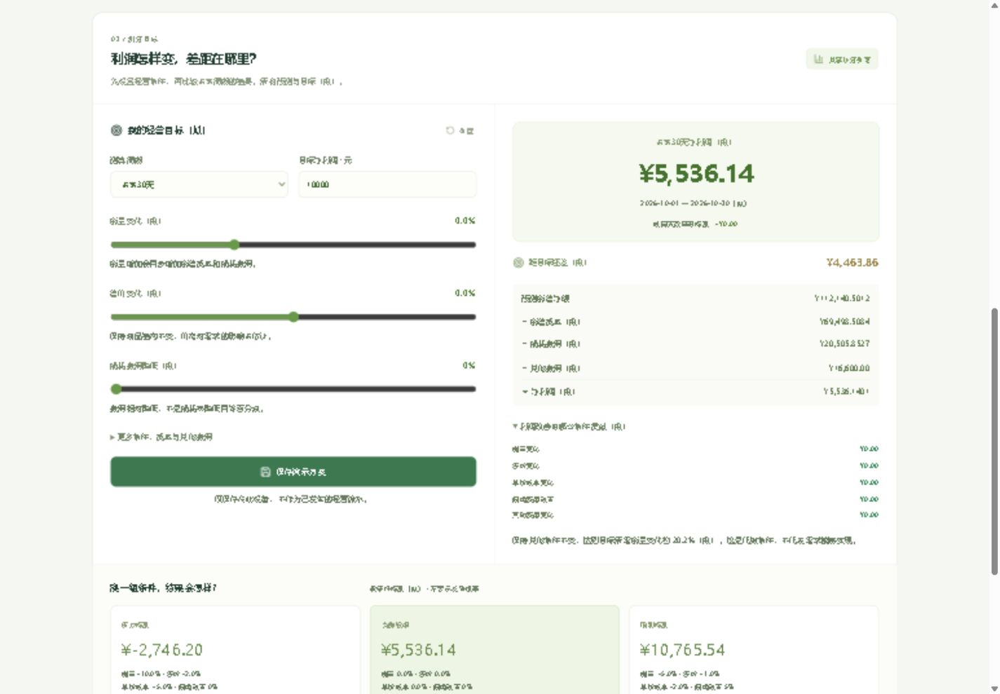

# 智链销国内商超经营智能体

新版源码：https://github.com/poban11335577/zhilian-retail-agent

本轮仅发布 GitHub，未更新 Netlify。原网站 https://zhilian-business-poban.netlify.app/ 是旧版入口；查看本轮手机和电脑对话界面请按下方步骤本地运行。

中文经营对话工作台，兼顾手机与电脑。可查询同一账套的销售、采购、库存与财务，按预算测算备货，保存可回查的执行轨迹与方案审核记录。
本项目仍在完善业务执行闭环，不承诺获奖或真实门店收益。拟定业务以“（拟）”标记。
协作方式见 CONTRIBUTING.md；国内数据与拟定口径见 DATA_SOURCES.md。



<details><summary>查看手机布局</summary>


</details>

## 运行与构建

要求 Node.js 24。本地独立生成私有配置，不包含生产网站凭据。

```text
npm ci
node scripts/setup.mjs
npm run dev
npm test
npm run build
```

默认首页经营智能体；/growth经营增长与利润目标，/scenario备货，/real-data八类明细和报表，/admin管理。自有企业咨询/enterprise-chat，独立企业账本与历史导入不是公共案例的续写。

Netlify服务器需要ADMIN_PASSWORD_HASH、SESSION_SECRET；本地setup生成私有配置。后台支持Ark Responses，密钥加密保存。不要上传.env、.local-data、.netlify或管理员私有密码文件。

49项测试；主要数据和计算入口为public/data/domestic-*.json、lib/case-book.ts、server/case-workflow.ts、server/case-language.ts、server/case-evidence.ts、lib/stock-forecast.ts、lib/profit-forecast.ts、lib/goal-planner.ts。通用企业ledger是独立系统。当前公共案例按整数克和万分之一元计算，参考成本、采购与损耗明确标（拟）。

官方数据、日期平移、真实/拟定边界及完整剩余问题见docs。Excel16张表与网站数据同源。源码保留旧英国案例供历史测试，不作为默认国内案例。

## 重建公共账套

```text
python scripts/build-domestic-case.py scripts/data-inputs/domestic
```

需Python，输入为从官方Excel读取的选择JSON和原附件哈希清单，含原表行号与原始日期。官方原始附件下载地址及哈希记录在公开source元数据中，可与原文件核验。该脚本写public/data，两份JSON需重新构建部署。只重建演示账套，不代表真实记账或预测验证。Excel需同步按同一数据重导出，不能只换网页数据。

`npm run build` 会从两份完整账套生成轻量首页概览，再构建页面和后端。首页不下载完整销售明细；经营数据页按需加载原账套。

当前默认采购审核只保存意见，不自动记账。角色配置不意味着9个独立推理模型；模型只能依据只读工具证据提出建议。

## 目标经营智能体与利润 Skill

`/growth` 展示原始销售趋势、等长周比较和商品分析线索。输入未来7/14/30天目标与采购预算后，智能体比较经营方案，将分日采购可支持的销量接入利润。可连续追问预算减半、只改损耗、保留其他条件或选择上一轮方案。

问答示例：`未来30天全店目标净利润10000元，采购预算60000元。帮我比较经营方案，核对备货与利润。` 然后问 `那预算减半`。

网页和对话结果支持中文报告（HTML，可打印/保存PDF）以及Excel五张表：方案总览、方案比较、商品备货、分日流水、数据与口径。Excel是当前测算快照，保留公式和全量明细，复杂经营条件请在网页重算。保存方案仅存此浏览器，不写入已发生业务流水。

可复用技能位于 [skills/profit-forecast/SKILL.md](skills/profit-forecast/SKILL.md)，在项目根目录运行：

```text
node skills/profit-forecast/scripts/forecast.mjs
node skills/profit-forecast/scripts/forecast.mjs conditions.json
```

网页、问答与脚本使用同一计算引擎。`npm run build` 从完整账套生成销售与供货基线，无需在增长页面下载完整销售JSON。销售额由原表数量与单价演算；成本、损耗及其他费用（拟），未来结果与目标（拟），不表示已实现增长或原商超真实利润。详细改动和演示提问见 [目标经营智能体版本说明](docs/目标经营智能体版本说明.md)。

上一版利润工作台截图（新版目标规划请本地运行）：



